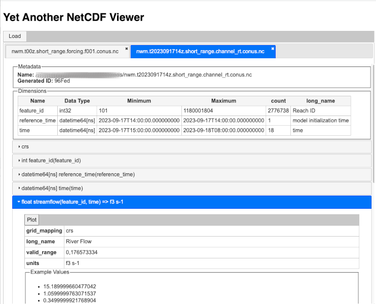

# Yanv
Yet Another Netcdf Viewer

Yanv is a netcdf viewer implemented via python that will launch a server providing web access to visualizations for one or 
more netcdf files via commandline and possibly simple application (long term goal).

Basic usage is:

```shell
$ python -m yanv
Access Yanv from http://0.0.0.0:10324/
======== Running on http://0.0.0.0:10324 ========
(Press CTRL+C to quit)

```
<p>
    
</p>

## What This is Not

This is not meant to be a web application. Steps are in place to prevent this from running across a network. This application investigates and lets you see items and structures on
your filesystem. Allowing external access will reveal the file structure of your machine and is highly discouraged. 
$${\color{red}\textbf{Run} \space \textbf{on} \space \textbf{a} \space \textbf{network} \space \textbf{at} \space \textbf{your} \space \textbf{own} \space \textbf{risk}}$$

## Features

The web view offers 4 major functions:

- [x] Open and view multiple files at a time
- [x] Explore dimension data
- [x] Explore variable data
- [ ] Create scatter plots for vector data

## Long term goals

* Double-click to launch
* Map plotting
* Data querying
* Data transformations
* Simple data manipulation (such as joining two files)
* Other data types, such as CSV (to provide another avenue for data manipulation, such as providing further metadata 
for variables)

## Important Dependencies

This relies on:

- Plotly
- Xarray
- websockets
- aiohttp
- jQuery

## General Workflow

### 1. Application starts on port 10324 (by default, but overridable)

The application starts via [yanv.server.serve()](./yanv/server.py). CLI parameters may set parameters like the bound 
port or the path to the index page.

### 2. Handle requests via aiohttp.web.run_app

This does not use flask or Django - just raw aiohttp (for better or worse).

There are three points of entry to the application via tcp:

- `/{INDEX_NAME}`
  - The main screen of the application. Customizable, generally blank
- `/ws`
  - The entrypoint for websocket connections
- `/navigate`
  - Used for file path autocomplete

This is primarily a single page app the communicates via a single websocket connection at /ws

### 3. Websocket Handling

Websocket handling occurs within [yanv.handlers.websocket::socket_handler](yanv/handlers/websocket.py). 
`socket_handler` is an `async` function that establishes the socket and loops through received messages to pass 
them through the additionally async function at [yanv.handlers.websocket::handle_message](./yanv/handlers/websocket.py).

### 3.1 `handle_message`

`handle_message` does the majority of the heavy lifting where it is responsible for making sure the message from the 
client is parsed and passed to an appropriate handler. Passed messages are expected to be json and will be attempted 
to be parsed into a [yanv.messages.requests.MasterRequest](./yanv/messages/requests/__init__.py). A `MasterRequest` 
is simply a wrapper around what is called a `YanvRequest`, found within [yanv.messages.requests.base](./yanv/messages/requests/base.py).
